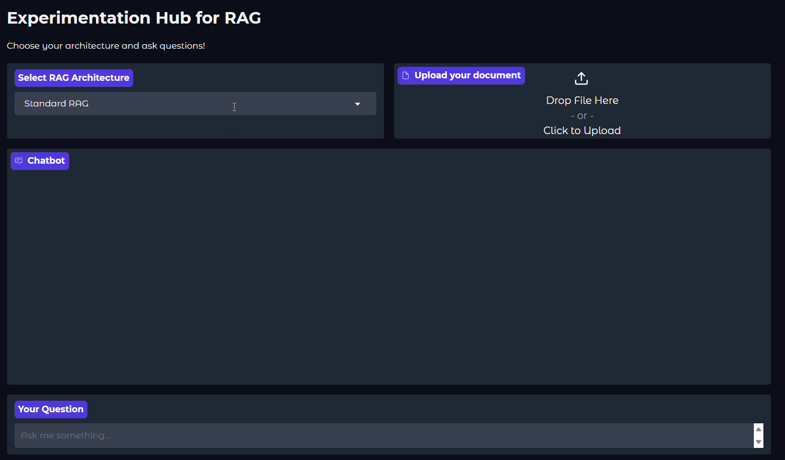

# Experimentation Hub for RAG

The **Experimentation Hub for RAG** is a comprehensive framework to create, test, and benchmark different Retrieval-Augmented Generation (RAG) pipelines. It supports advanced RAG architectures such as Agentic RAG and Graph RAG, among others. The hub allows you to experiment with various splitters, embedding models, vectorstores, document retrievers, rerankers, LLM generators, and agentic configurations, while in experiments you can measure key performance metrics such as retrieval latency and generation speed. Additionally, it provides a Gradio-based UI for interactively querying different RAG architectures and offers full scalability for customizing pipelines and running experiments at any scale.

---

## Features

* Supports multiple **RAG architectures**:
  * Standard RAG
  * Standard RAG with Memory
  * Hybrid RAG (dense embeddings for semantic search + sparse keyword-based search)
  * Rerank RAG (retrieves documents then reranks them for relevance)
  * Online RAG (fetches documents from the web in real-time)
  * Agentic RAG (agent decides whether to use local retriever, web retriever, or conversation history)
  * Graph RAG (represents documents as a graph of entities and relationships to answer queries via graph traversal)
* Flexible **chunking strategies**:
  * Recursive, character-based, or token-based splitting
  * Configurable chunk size and overlap
* Supports different **embedding models**:
  * HuggingFace, OpenAI, Cohere
* Experimentation with **vectorstores**:
  * FAISS, Chroma, Pinecone, Weaviate
* Configurable **retrievers** and **rerankers** for document selection
* LLMs from multiple providers:
  * OpenAI, Anthropic, Gemini, Groq, DeepSeek
* Measures and logs performance metrics in experiments:
  * **Retriever latency** – time taken to fetch relevant documents from vectorstores
  * **Generator latency** – time taken by the LLM to generate a response
* **web-based UI** using Gradio for interactive exploration
* Designed for reproducible experiments and **easy extension**

---

## Gradio UI Demo




---

## Project Structure

```
.
├── apps/
│   └── gradio_app.py                     # Gradio-based chatbot UI for interacting with RAG
├── experiments/
│   ├── measure_retriever_timings.py      # Script to benchmark retriever performance
│   ├── measure_generator_timings.py      # Script to benchmark generator performance
│   └── analysis.ipynb                    # Jupyter notebook for analyzing experiment results
├── src/
│   ├── rag_architectures/                # Different RAG pipeline implementations
│   │   ├── standard_RAG.py               # Standard RAG (retriever + generator)
│   │   ├── standard_RAG_with_memory.py   # RAG with conversation memory
│   │   ├── hybrid_RAG.py                 # Hybrid retriever (dense + sparse)
│   │   ├── rerank_RAG.py                 # RAG with document reranker
│   │   ├── online_RAG.py                 # Online RAG with web search
│   │   ├── graph_RAG.py                  # Graph RAG
│   │   └── agentic_RAG.py                # Agentic RAG with decision making
│   ├── data_loaders.py                   # Load documents (PDFs, dirs, etc.)
│   ├── splitters.py                      # Split documents into chunks
│   ├── embeddints.py                     # Load and manage embedding models
│   ├── vectorstores.py                   # Build and manage vector databases
│   ├── retrievers.py                     # Implement different retriever classes
│   ├── rerankers.py                      # Implement reranker models
│   ├── generators.py                     # Wrapper for LLM providers (OpenAI, Anthropic, etc.)
│   ├── memory.py                         # Conversation memory 
│   ├── rag_chain.py                      # RAG chain logic (retriever + generator)
│   ├── agents.py                         # Agent workflow for source selection
│   └── graph.py                          # Graph class: converts document chunks into a NetworkX-based entity graph using LLMGraphTransformer
├── tests/                                # Unit and integration tests
│    └── ...
├── data/
│   └── eu.pdf                            # Example dataset (test document)
├── assets/
│   └── ui.gif                            # Demo animation for README
├── Config/
|   └── config.yaml                       # Experiment & pipeline configuration
├── helpers/
│   └── weaviate db/
│       └── docker-compose.yml            # Setup for local Weaviate vector DB using Docker
├── pyproject.toml                        # Project dependencies & build config
├── uv.lock                               # Dependency lock file (auto-generated by uv sync command)
├── .env.example                          # Example environment variables file
└── README.md                             # Main project documentation

```

---

## Setup

### 0. Prerequisites
- Install **Python 3.12+**  
- Install **uv** (package/dependency manager)

### 1. Clone the repository
```bash
git clone https://github.com/vasiliskou/Experimentation_Hub_for_RAG
cd Experimentation_Hub_for_RAG
```

### 2. Create an environment and install dependencies
```bash
uv sync
```

### 3. Configure environment variables
Rename **.env.example** to **.env** and fill in the required API keys as shown in the example file.

---

## Configuration

All RAG pipeline parameters are configurable via `config/config.yaml`:

```yaml
  .
  .
  .
generator:                  # Generator / LLM configuration
  provider: "openai"        # LLM provider: "openai", "anthropic", "gemini", "groq", "deepseek"
  model_name: "gpt-4o-mini" # Specific model name from provider
  max_tokens: 500           # Max tokens in output
  temperature: 0.6          # Creativity vs determinism (higher = more creative)
  top_p: 0.9                # Nucleus sampling (probability cutoff for token choices)
  timeout: 10               # Max time (seconds) to wait for response
  max_retries: 2            # Retry attempts if API call fails
  .
  .
  .

```
---

## Running

### Gradio Interface
```bash
uv run apps/gradio_app.py
```

### Experiments
``` bash
uv run experiments/<experiment_script>.py
```
Currently, two experiments are implemented:
* Retriever latency measurement (measure_retriever_timings.py)
* Generator latency measurement (measure_generator_timings.py)

The framework is scalable to any number of experiments you want to add.

Use experiments/analysis.ipynb to analyze and visualize the results.

---

## 3 Ways of Usage

* **Interactive mode:** Use the Gradio UI (`apps/gradio_app.py`) to upload documents and interactively query different RAG architectures, observing retrieval and response behavior.
* **Experimentation mode:** Place your documents in `./data/` and run scripts in the `experiments/` folder to measure metrics such as retriever latency or generator speed, log results to CSV, and analyze them using the provided `analysis.ipynb`.
* **Custom architectures & elements & experiments:** You can create your own RAG architectures, add or replace components, and run custom experiments to measure performance or test different setups.


---

## License

MIT License – see `LICENSE` file for details
